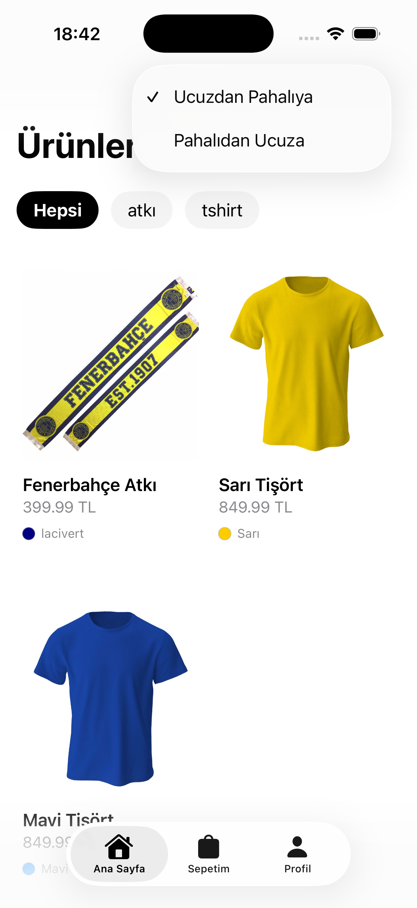
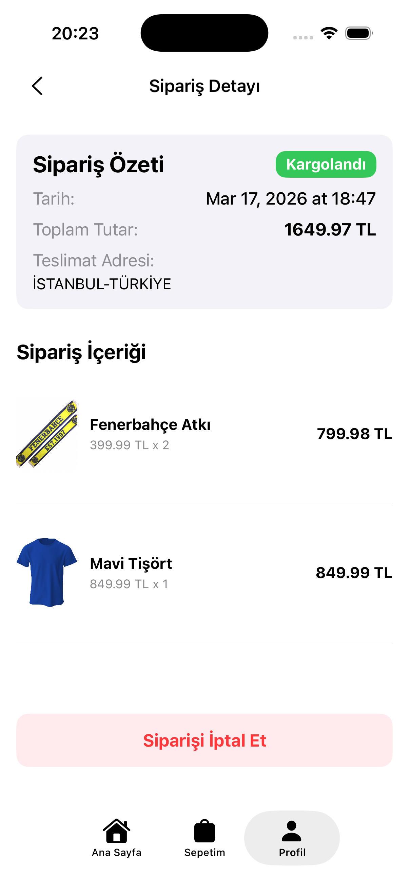
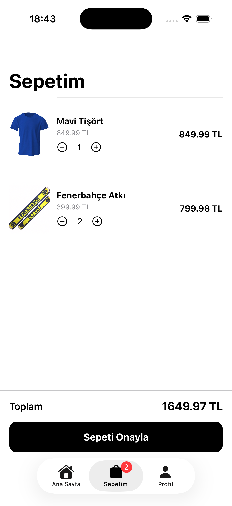
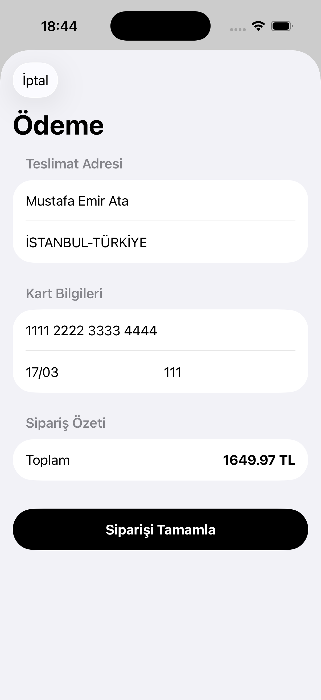
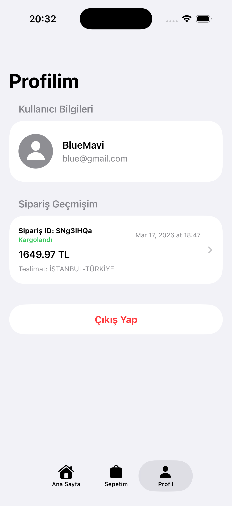

# 🛍️ ClothesApp

Modern iOS geliştirme prensiplerine uygun olarak tasarlanmış ClothesApp, Firebase altyapısı kullanan, MVVM mimarisi ile geliştirilmiş bir e-ticaret mobil uygulamasıdır. Uygulama; ürün listeleme, kategori filtreleme, sepet yönetimi ve sipariş işlemleri gibi temel e-ticaret fonksiyonlarını içermektedir.

## 🚀 Features

### 📦 Ürün Yönetimi
* Firebase Firestore kullanılarak ürün verileri dinamik olarak yönetildi
* Firebase Storage üzerinden ürün görselleri saklandı
* Kategori bazlı filtreleme sistemi geliştirildi

### 🏠 Ana Sayfa Modülü
* Kategorilere göre ayrılmış ürün listeleme
* Dinamik veri çekme yapısı
* MVVM pattern ile temiz state yönetimi

### 🛒 Sepet (Cart) Modülü
* Ürün ekleme / çıkarma
* Toplam fiyat hesaplama
* Gerçek zamanlı sepet güncelleme

### 💳 Ödeme (Payment) Modülü
* Dinamik model yapısı ile ödeme akışı
* Sipariş oluşturma sistemi
* Sipariş durumu takip edebilme
* Sipariş iptal edebilme

## 🧱 Architecture

* MVVM (Model-View-ViewModel) mimarisi
* Modüler ekran yapısı
* Reusable component mantığı
* Clean code prensipleri

## 🛠️ Technologies

* SwiftUI
* MVVM Architecture
* Firebase Firestore
* Firebase Storage
* Firebase Authentication
* Combine (State Management)

## 📱 Screenshots

<table>
<tr>
<td align="center">

### 🏠 Ana Sayfa

</td>

<td align="center">

### 📄 Sipariş Detayı

</td>
</tr>

<tr>
<td align="center">

### 🛒 Sepet

</td>

<td align="center">

### 💳 Ödeme

</td>
</tr>

<tr>
<td colspan="2" align="center">

### 👤 Profil

</td>
</tr>

</table>

## ⚙️ Project Structure

ClothesApp
│
├── Models
├── ViewModels
├── Views
├── Services
├── Firebase
└── Utilities

## 🧠 Architecture Detail

Proje MVVM design pattern kullanılarak geliştirilmiştir:

* **Model** → Veri yapıları
* **View** → SwiftUI ekranları
* **ViewModel** → Business logic ve state yönetimi

Bu yapı sayesinde:
* Code maintainability arttırıldı
* Test edilebilirlik sağlandı
* Component bazlı geliştirme mümkün hale getirildi

## 👨‍💻 Developer

**Mustafa Emir Ata**
* GitHub: [mustafaemirata](https://github.com/mustafaemirata)

 burada resimler alt alta duruyor 2 tane yan yana altında 2 tane yine yan yana görünümlü gösterelim başlıklarıykla
